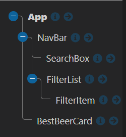
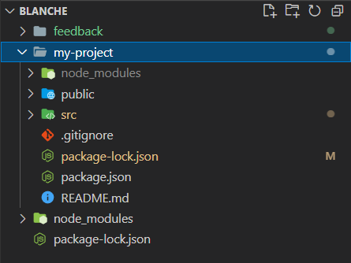
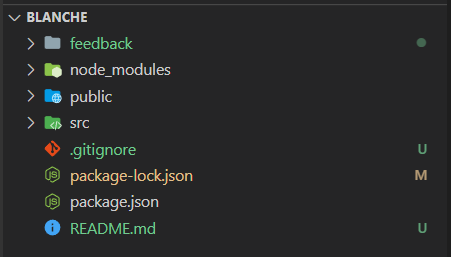

# Feedback

Hey Charlie here, feel free to message me on Slack if you want any clarification on the points below. I will give you both positive and constructive feedback on your project.

---

## Requirements

- Should be built in React - DONE
- Use the Punk API (after using the data file first) - ALMOST DONE
  - With a little tweak I fixed your interaction with the API so almost done.
- Test where possible (RTL) - NOT DONE
  - Was covered late on the course so try and some tests when you have time.
- Repository on GitHub - DONE

### Start

> "All the wireframe content in black is the first part of the challenge - that is, the sidenav, the main section containing the beers and beer cards for each piece of data. The component tree is below to help you get started."

Below I have the component tree from the brief and your component tree.




You are missing a couple of components. I understand that it may seem overkill to have the `<Main/>` and `<CardList/>` components and it probably is with an application this size. 

The reason why we have them in the brief is to force you to pass data with props. It is important to understand that you can get props through multiple components. From the top to the bottom.

I am confident with your understanding of props as you have demonstrated it getting values from the `<App/>` to the `<FilterItem/>`. When you have some time try introducing both of these `<Main/>` and `<CardList/>`.

### Extension 1

> Once you've got the design and layout sorted to render the elements, it's time to add some search functionality. Make it so you can search the beers by their name, and the page content should update as you type each letter in the box.

The aim of this extension is to get you using functions as props. You have smashed it, `handleInput()` in your app is being passed multiple component levels to your search component. That component is using the function to capture the user input and storing it in the App state. You are then able to use the value to filter the beers you import from the data file. This is great!

```jsx
// App.jsx
const filteredBeers = beers.filter(beer => {
  const beersLower = beer.name.toLowerCase();
  const searchWordsLower = searchWords.toLowerCase();
  // .includes() WILL GIVE YOU TRUE / FALSE -> YOU CAN JUST RETURN THIS FROM YOUR FILTER
  return beersLower.includes(searchWordsLower);
});
```

**Side note**

The reason why you weren't seeing the result from your API was because of your `filteredBeers` it was set to use the beer data file this is your `beer` import. The state you are storing the data you get back from the API is `beers`.

```jsx
// App.jsx

const filteredBeers = beer.filter(() => {// YOUR FILTER FUNCTION})

// SHOULD BE

const filteredBeers = beers.filter(() => {// YOUR FILTER FUNCTION})
```

### Extension 2

> Finally attempt to make it so you can filter the content on three conditions:
>
> - High Alcohol (ABV value greater than 6%)
> - Classic Range (Was first brewed before 2010)
> - High Acidity (pH lower than 4)

You are so close! and it does work if you make the change I mentioned above. I can see you are updating your api URL with the correct params to get by abv and by classic range. It works in certain cases but the idea is there you just need to tidy it up a little bit and move a couple of things around.

Which we look

```jsx
// App.jsx
// YOUR USE EFFECT IS GREAT
// - YOU ARE ADDING ALL OF THE DEPENDENCIES TO THE ARRAY
// - YOU ARE GIVING THEM AS ARGUMENTS TO YOUR getBeers()
useEffect(() => {
  getBeers(filterHighAlc, filterAcidity, filterClassicRange);
}, [filterHighAlc, filterAcidity, filterClassicRange]);

const baseUrl = "https://api.punkapi.com/v2/beers";
// MAKE SURE YOUR ARGUMENTS MATCH WHAT YOU ARE GIVING IT IN THE USE EFFECT
const getBeers = async (filterHighAlc, filterAcidity, filterClassicRange) => {
  let queryParameter = "";
  // THE URL CAN BE THE BASE URL FROM THE START
  let url = baseUrl;
  // THIS IS NICE AND CLEAR GOOD GOING :)
  //  -> IF TOGGLE IS TRUE ADD THE PARAM
  if (filterHighAlc) {
    queryParameter += "?abv_gt=6";
  }

  if (filterClassicRange) {
    // THIS COULD BE A TURNERY?
    queryParameter += queryParameter ? "&brewed_before=01-2010" : "?brewed_before=01-2010";
  }

  if (queryParameter) {
    url += queryParameter;
  }

  const response = await fetch(url);
  const data = await response.json();

  // YOU HAD THE LOGIC TO APPLY THIS FILTER I JUST MOVED INTO THIS FUNCTION
  // - BECAUSE THIS IS ALL ABOUT GETTING / SHOWING THE BEERS YOU WANT TO SEE
  // IF YOU NEED THEM FILTERED -> FILTER THE DATA AND SET IT TO STATE
  // ELSE SET THE DATA TO STATE
  if (filterAcidity) {
    const filterAcidity = data.filter(beer => beer.ph < 4);
    setBeers(filterAcidity);
  } else {
    setBeers(data);
  }
};
```

### Extension 3

> Style the website however you see fit! Go wild!

You have some basic styles that work for the 6 beers from the data file, when you update it to use the 25 the api gives you back they overflow. 

I can see that you have prioritized the functionality which makes sense, when you have time come back and style it :).

---

## The App

### Positive

- It displays the content on desktop and matches the wire frame basic layout.
- I like the colors you are using.
- You have all of functionality needed.
- It is dynamic and responding to the user interacting with it.

### Constructive

- Currently you need to re-organize the project.
  - You have `node_modules` on github this is bad idea as this is a big folder that can be autogenerated from the package.json
  - I am not sure how this has happened but it might be because you have a project with in a project.
  - You will want to move the contents of the `my-project` folder out of that folder and delete it.

Currently it looks like this.



It should be.



Let me know if you need a hand as you never want git to watch `node_modules` as they are quite big. This is why you have the `.gitignore` file.

[gitignore]("https://www.freecodecamp.org/news/gitignore-what-is-it-and-how-to-add-to-repo/#:~:text=gitignore%20file%20is%20a%20text,all%20of%20your%20Git%20repositories")

---

## The Code

### Positive

- Very well componentized code across the board.

- You have multiple functions being passed across your application to the components that need them.

- You are utilizing the power of query params!

- I feel confident with your understanding of props, useState, useEffect and funcs as props.

- Awesome good going! I can't wait to see what you build next.

### Constructive

You have some errors in the console related to what you are doing in the `<FilterItem/>` component.

```
Warning: React does not recognize the `filterHighAlc` prop on a DOM element. If you intentionally want it to appear in the DOM as a custom attribute, spell it as lowercase `filterhighalc` instead. If you accidentally passed it from a parent component, remove it from the DOM element.
    at input
    at div
    at FilterItem (http://localhost:3000/static/js/bundle.js:463:5)
    at div
    at FilterList (http://localhost:3000/static/js/bundle.js:365:5)
    at div
    at NavBar (http://localhost:3000/static/js/bundle.js:616:5)
    at section
    at div
    at section
    at div
    at App (http://localhost:3000/static/js/bundle.js:39:88)

```

The code below removes the error for highAlcohol you can do the same for your other inputs.

```jsx
// FilterItem.jsx

<input
  id={"highAlcohol"}
  type="checkbox"
  name={label1}
  onChange={onChange}
  value={"highAlcohol"}
  // THIS IS NOT A COMPONENT SO YOU DO NOT NEED TO GIVE IT PROP
  // LIKE BELOW
  // filterHighAlc={filterHighAlc}
  // THE filterHighAlc IS YOUR CHECKED STATE -> TRUE OR FALSE
  checked={filterHighAlc}
  className="filter-list__checkbox"
/>
```

Have a go at making `<FilterItem />` on input and `<FilterList/>` a component that is able to make multiple `<FilterItem />`.

---
